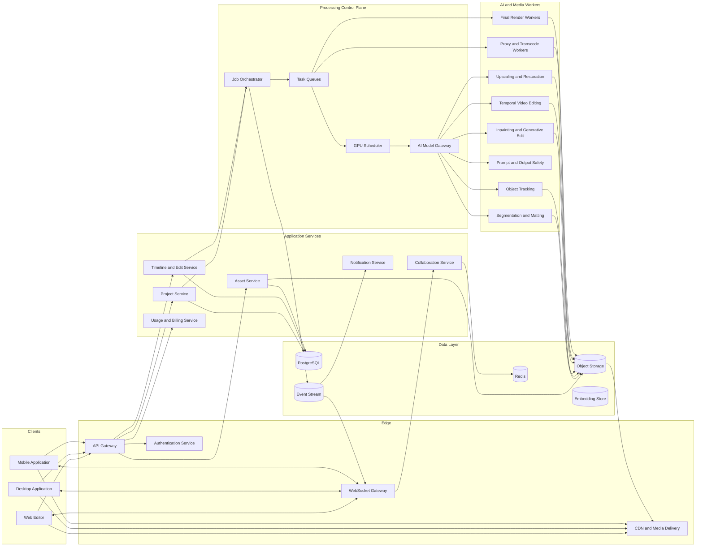
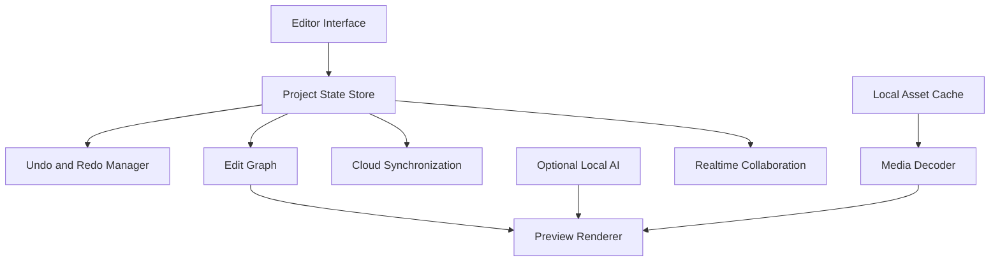
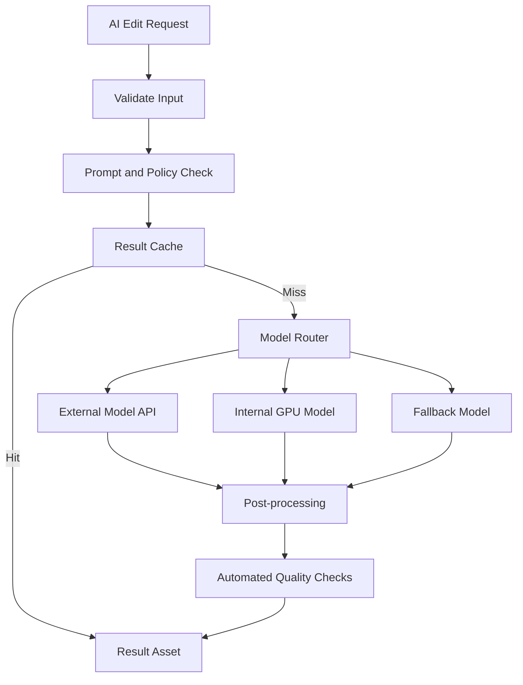
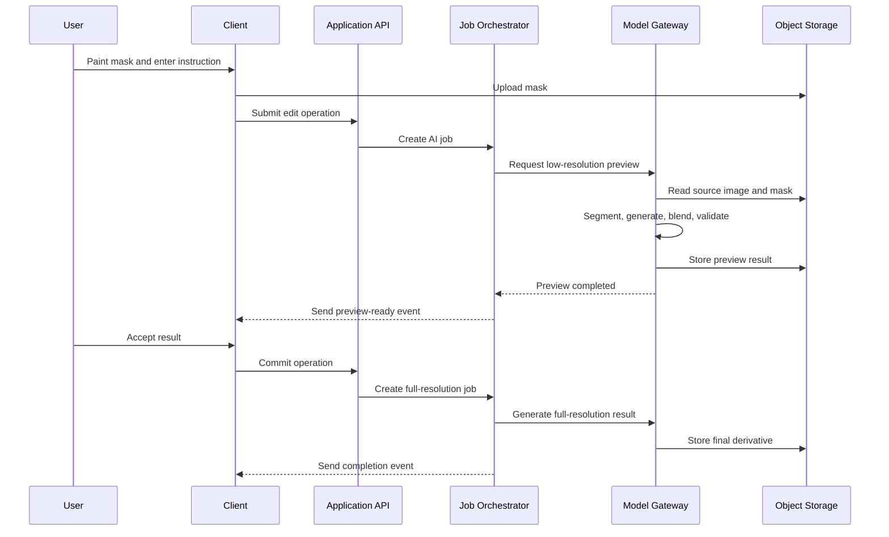
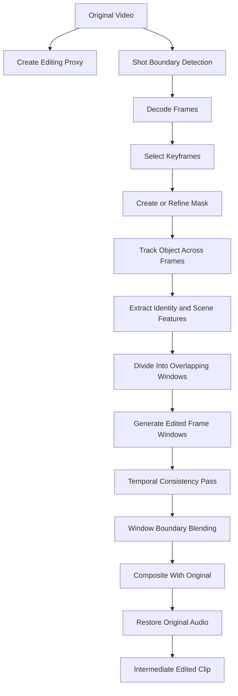
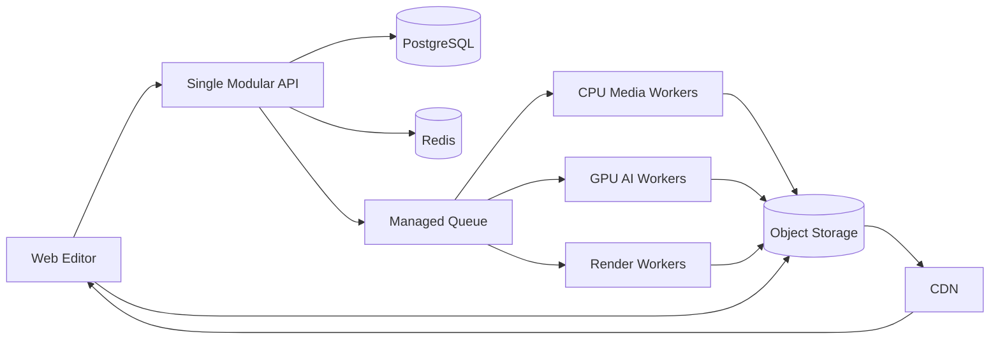

# Reference Architecture: AI Photo and Video Editing Application

Below is a production-oriented architecture for an application that supports:

- Non-destructive photo and video editing
- Text-driven editing
- Object removal and generative fill
- Background replacement and outpainting
- Subject selection, masking, and tracking
- Video timeline editing
- Temporal consistency across frames
- Upscaling and restoration
- Collaborative projects
- Cloud rendering and export

The central design principle is: **interactive edits happen locally whenever possible, while expensive AI inference and final rendering run asynchronously on cloud CPU/GPU workers.**

---

## 1. High-Level Architecture



---

## 2. Core Architectural Principles

### Non-destructive editing

The application should never directly modify the original uploaded file.

Store three things separately:

1. **Original asset** — immutable source photo, audio, or video.
2. **Edit graph** — structured instructions describing every edit.
3. **Generated derivatives** — previews, proxies, AI results, thumbnails, and exports.

For example:

```json
{
  "operationId": "op_40291",
  "type": "generative_replace",
  "inputAssetId": "asset_original_123",
  "maskAssetId": "mask_781",
  "prompt": "Replace the cloudy sky with a warm sunset",
  "negativePrompt": "buildings, birds, text",
  "seed": 18432,
  "modelProfile": "image-edit-balanced",
  "parameters": {
    "guidance": 6.5,
    "preserveStructure": 0.85,
    "blendStrength": 0.72
  }
}
```

Undo, redo, branching, and version history are implemented by changing the active edit graph rather than rewriting media files.

### Proxy-first video editing

Users should not edit the original 4K or 8K video directly.

After upload, generate:

- Low-resolution editing proxy
- Thumbnail strip
- Audio waveform
- Keyframes
- Shot boundaries
- Technical metadata
- Optional speech transcript
- Optional object and scene embeddings

The editor uses the proxy for responsiveness. The final render applies the same edit graph to the original media.

### Asynchronous AI processing

Generative operations can take seconds or minutes, especially for video. They should run as jobs rather than synchronous API requests.

The client submits a job and receives a job identifier:

```json
{
  "jobId": "job_98014",
  "status": "queued",
  "estimatedCostUnits": 32
}
```

Progress is delivered through WebSockets or server-sent events:

```json
{
  "jobId": "job_98014",
  "status": "running",
  "progress": 0.64,
  "stage": "temporal_consistency_pass",
  "previewAssetId": "preview_441"
}
```

### Model abstraction

Do not couple the application directly to one image or video model.

All model calls should go through an **AI Model Gateway** with a consistent internal interface. This lets you replace models, use external APIs, or route jobs to your own GPU infrastructure without changing the editor.

---

## 3. Client Architecture

The client is responsible for the editor experience, low-latency previews, and local editing operations.



### Editor modules

#### Photo workspace

- Canvas
- Pan and zoom
- Crop and rotation
- Layers
- Masks
- Brush tools
- Color adjustments
- Generative fill
- Object removal
- Background replacement
- Before-and-after comparison

#### Video workspace

- Multitrack timeline
- Video, audio, text, and effect tracks
- Clip trimming and splitting
- Transitions
- Keyframes
- Masks and tracking
- Proxy playback
- Frame-accurate seeking
- Preview quality controls
- Audio waveform
- Render-range selection

#### Local preview engine

Use the local GPU for inexpensive operations such as:

- Crop and transform
- Brightness and contrast
- Color matrix operations
- Blur
- Compositing
- Mask visualization
- Text overlays
- Basic transitions
- LUT application

A web application can use Canvas, WebGL, WebGPU, WebCodecs, and Web Audio. A desktop application can wrap the web editor with Tauri or Electron, or use a native rendering engine.

---

## 4. Backend Services

### API Gateway

The API Gateway provides:

- Authentication enforcement
- Request validation
- Rate limiting
- Workspace isolation
- API versioning
- Request tracing
- Idempotency handling
- Routing to internal services

Large media files should not pass through the API Gateway. The Asset Service should issue signed upload URLs so clients upload directly to object storage.

### Authentication and authorization

Use workspace-based authorization with roles such as:

- Owner
- Administrator
- Editor
- Reviewer
- Viewer

Authorization should be checked for every project, asset, comment, job, and export.

### Project Service

Responsible for:

- Project creation
- Project membership
- Version history
- Project settings
- Active edit version
- Project duplication
- Archiving
- Templates

### Asset Service

Responsible for:

- Signed upload and download URLs
- Media metadata
- Asset checksums
- Storage locations
- Asset relationships
- Retention policies
- Thumbnail and proxy references
- Upload completion events

The Asset Service should calculate a content hash. This enables deduplication and result caching.

### Timeline and Edit Service

Responsible for:

- Tracks and clips
- Clip source ranges
- Transforms
- Effects
- Keyframes
- Masks
- Layer ordering
- Edit operations
- Timeline snapshots
- Edit graph validation

A simplified timeline representation might look like this:

```json
{
  "timelineId": "timeline_1001",
  "durationMs": 45000,
  "frameRate": {
    "numerator": 30000,
    "denominator": 1001
  },
  "tracks": [
    {
      "trackId": "video_1",
      "type": "video",
      "clips": [
        {
          "clipId": "clip_701",
          "assetId": "asset_301",
          "timelineStartMs": 0,
          "sourceStartMs": 2500,
          "sourceEndMs": 47500,
          "operations": [
            "op_crop_1",
            "op_color_1",
            "op_ai_background_1"
          ]
        }
      ]
    }
  ]
}
```

### Collaboration Service

Use WebSockets for presence, cursors, comments, and live updates.

For simultaneous editing, use either:

- A CRDT-based document model
- An operational transformation system
- Server-authoritative timeline operations with optimistic client updates

AI-generated binaries do not need CRDT synchronization. Only their metadata and asset references need to be synchronized.

---

## 5. AI Model Gateway

The Model Gateway gives the rest of the application one interface for all AI operations.



### Responsibilities

The Model Gateway should handle:

- Model selection
- Model versioning
- Prompt construction
- Input preprocessing
- Image and video normalization
- GPU routing
- External-provider authentication
- Retries and timeouts
- Cost tracking
- Result caching
- Safety checks
- Output validation
- Model fallback
- Experiment assignment

### Internal model contract

```json
{
  "operation": "video_object_replace",
  "inputs": {
    "videoAssetId": "asset_video_22",
    "maskSequenceAssetId": "asset_masks_91",
    "referenceImageAssetId": "asset_reference_16"
  },
  "instruction": "Replace the red backpack with a black leather backpack",
  "constraints": {
    "preserveCameraMotion": true,
    "preserveSubjectIdentity": true,
    "preserveLighting": true,
    "temporalConsistency": "high"
  },
  "output": {
    "resolution": "1920x1080",
    "frameRate": 30,
    "format": "intermediate"
  }
}
```

The client should not send provider-specific parameters. The gateway converts application-level settings such as `quality: high` into model-specific parameters.

---

## 6. Photo Editing Pipeline

A generative photo edit can follow this pipeline:



### Detailed stages

1. Normalize orientation and color profile.
2. Convert the user's brush strokes into a clean mask.
3. Optionally refine the mask with segmentation.
4. Add padding around the edit region.
5. Generate multiple preview candidates.
6. Check structural similarity outside the mask.
7. Reject candidates that modify protected regions.
8. Blend the selected result into the source.
9. Match grain, noise, sharpness, and color.
10. Save the operation and generated result as a new version.

A useful quality-control rule is to compare pixels outside the editable region. Unrequested changes beyond a configured tolerance should cause the result to be rejected or regenerated.

---

## 7. Video Editing Pipeline

Video AI editing requires more than processing each frame independently.



### Temporal consistency strategy

A robust pipeline should use several techniques together:

#### Shot-aware processing

Never run one temporal process across a hard camera cut. Detect shot boundaries first and process each shot independently.

#### Keyframe conditioning

Generate or edit selected keyframes first. Those keyframes become visual references for neighboring frames.

#### Mask propagation

The user creates a mask on one frame. An object-tracking model propagates the mask through the shot.

Allow the user to correct masks on additional frames. Those corrections become tracking anchors.

#### Overlapping frame windows

Process video in windows such as:

- Frames 0–31
- Frames 24–55
- Frames 48–79

The overlap helps maintain continuity. Results in overlapping regions can be blended or chosen using a consistency score.

#### Identity conditioning

Create embeddings or reference features for the edited subject, clothing item, product, or background. Reuse these features across all frame windows.

#### Motion-aware generation

Provide optical flow, motion vectors, tracked landmarks, depth, or camera motion as additional conditioning where supported.

#### Final consistency pass

After generation, run a temporal correction stage to reduce:

- Texture flicker
- Color variation
- Edge instability
- Subject identity drift
- Mask boundary jitter
- Lighting changes

#### Protected regions

Only regenerate the required region. Composite untouched pixels from the original video wherever possible.

This minimizes unexpected changes and reduces GPU cost.

---

## 8. Job Orchestration

A workflow engine should coordinate multistage AI and rendering jobs.

### Job state machine

```text
CREATED
   ↓
VALIDATING
   ↓
QUEUED
   ↓
PREPROCESSING
   ↓
RUNNING
   ↓
POSTPROCESSING
   ↓
QUALITY_CHECK
   ↓
COMPLETED
```

Alternative terminal states:

```text
FAILED
CANCELED
TIMED_OUT
REJECTED
```

### Example video job graph

```text
Validate source
      |
Create proxy
      |
Detect shots
      |
+------------------------------+
| Process shot 1               |
| Process shot 2               |
| Process shot 3               |
+------------------------------+
      |
Join processed shots
      |
Temporal and visual QC
      |
Attach original audio
      |
Create preview
      |
Generate final-resolution result
```

Each stage should be restartable. A failed final render should not require repeating expensive AI inference.

---

## 9. GPU Worker Architecture

Different operations have different memory and latency requirements. Use separate worker pools.

| Worker pool | Typical workload | Scaling method |
|---|---|---|
| Segmentation | Masks, subject selection, matting | Request count |
| Image generation | Inpainting, replacement, outpainting | Queue depth and GPU memory |
| Video generation | Temporal generation and consistency | Pending frame count |
| Upscaling | Image and video super-resolution | Pixel count |
| Tracking | Object and mask propagation | Total video duration |
| Rendering | Composition, encoding, export | Output duration and resolution |
| CPU media | Metadata, thumbnails, audio waveform | CPU utilization |

GPU workers should be stateless. They download inputs from object storage, perform the operation, upload results, and report completion.

Use warm worker pools for common operations to avoid loading large model weights for every request.

---

## 10. Data Architecture

### PostgreSQL

Store durable application metadata:

- Users
- Workspaces
- Projects
- Project versions
- Assets
- Timelines
- Tracks
- Clips
- Edit operations
- AI jobs
- Render jobs
- Comments
- Permissions
- Usage records
- Model versions

### Object storage

Store:

- Original uploads
- Video proxies
- Thumbnails
- Masks
- Depth maps
- Optical-flow data
- Model inputs
- AI-generated results
- Intermediate render files
- Final exports

Use lifecycle rules to automatically delete disposable intermediate files after a defined period.

### Redis

Use Redis for:

- Session data
- Rate limiting
- Presence
- Short-lived project state
- Job progress
- Distributed locks
- Result lookup cache

Redis should not be the source of truth for projects or edit history.

### Event stream

Publish events such as:

```text
asset.uploaded
asset.proxy_ready
project.updated
ai_job.started
ai_job.progress
ai_job.completed
ai_job.failed
render.started
render.completed
usage.recorded
```

This decouples notifications, billing, analytics, collaboration, and orchestration.

### Embedding store

An embedding or vector store is optional. It can support:

- Semantic asset search
- Searching footage by description
- Subject similarity
- Reference retrieval
- Scene classification
- Reusing visual identity references

Do not use it as the primary metadata database.

---

## 11. Suggested API Structure

### Upload an asset

```http
POST /v1/projects/{projectId}/assets/uploads
```

```json
{
  "fileName": "beach-scene.mp4",
  "contentType": "video/mp4",
  "sizeBytes": 682391240
}
```

Response:

```json
{
  "assetId": "asset_201",
  "uploadUrl": "signed-upload-url",
  "expiresAt": "2026-07-19T22:00:00Z"
}
```

### Submit an AI edit

```http
POST /v1/projects/{projectId}/ai-jobs
```

```json
{
  "operation": "object_removal",
  "assetId": "asset_201",
  "maskAssetId": "mask_801",
  "range": {
    "startFrame": 240,
    "endFrame": 480
  },
  "quality": "preview",
  "clientRequestId": "06dbab18-20e9-45e6-b290-992cc62405bf"
}
```

### Read job status

```http
GET /v1/ai-jobs/{jobId}
```

### Commit a result to the edit graph

```http
POST /v1/projects/{projectId}/versions/{versionId}/operations
```

### Start an export

```http
POST /v1/projects/{projectId}/renders
```

```json
{
  "versionId": "version_810",
  "preset": "youtube_4k",
  "output": {
    "container": "mp4",
    "videoCodec": "h264",
    "audioCodec": "aac",
    "width": 3840,
    "height": 2160
  }
}
```

---

## 12. Rendering Architecture

The renderer should consume a versioned edit graph, not the current mutable editor state.

### Render stages

1. Freeze the selected project version.
2. Resolve all source assets and generated derivatives.
3. Validate that AI operations are complete.
4. Build a render plan.
5. Render independent segments in parallel.
6. Join segments.
7. Mix and normalize audio.
8. Encode the final file.
9. Run media integrity checks.
10. Upload the export.
11. Deliver through the CDN.

The rendering engine can use FFmpeg for decoding, filtering, composition, encoding, and audio processing. Custom GPU shaders or a native composition engine may be added for effects that are difficult to express with standard filters.

---

## 13. Privacy and Security

The architecture should include:

- Encryption in transit and at rest
- Signed asset URLs with short expiration times
- Workspace-level access controls
- Private object-storage buckets
- Audit logs for project and asset access
- Malware scanning for uploads
- Media type and codec validation
- Prompt and output safety checks
- Per-user and per-workspace rate limits
- Deletion and data-retention workflows
- Tenant isolation
- Model provider data-processing controls
- Explicit consent for biometric or face-related processing

Do not expose raw object-storage paths to clients. All asset access should be authorized and time-limited.

For third-party model APIs, the Model Gateway should prevent unnecessary user metadata from being sent to the provider.

---

## 14. Observability

Every AI and rendering job should include:

- Request identifier
- User and workspace identifier
- Project identifier
- Model name and version
- Input resolution or frame count
- GPU worker type
- Queue duration
- Inference duration
- Post-processing duration
- Failure category
- Estimated and actual compute cost

Important metrics include:

```text
Preview latency
Export latency
Queue wait time
GPU utilization
GPU out-of-memory rate
Job retry rate
Job cancellation rate
Cost per generated image
Cost per generated video second
Cache hit rate
Model acceptance rate
User regeneration rate
Temporal consistency failure rate
```

A high regeneration rate can indicate that a model produces technically valid but visually unsatisfactory outputs.

---

## 15. Recommended Technology Stack

A practical implementation could use:

| Layer | Recommended options |
|---|---|
| Web editor | React and TypeScript |
| Desktop packaging | Tauri or Electron |
| Browser media | WebCodecs, WebGL or WebGPU, Web Audio |
| API services | TypeScript, Go, or Python |
| AI services | Python and PyTorch |
| Workflow orchestration | Temporal-style workflow engine or durable job orchestrator |
| Task queues | Kafka, RabbitMQ, or a managed cloud queue |
| Metadata database | PostgreSQL |
| Cache and presence | Redis |
| Media storage | S3-compatible object storage |
| Media processing | FFmpeg |
| Model serving | Dedicated Python workers, Triton, KServe, or equivalent |
| Containers | Docker |
| Deployment | Kubernetes or managed container services |
| Monitoring | OpenTelemetry, Prometheus, Grafana, and error tracking |
| CDN | Cloud CDN in front of generated media |

The architecture matters more than the exact products. Keep storage, queue, model provider, and rendering implementations behind interfaces.

---

## 16. MVP Architecture

For an initial product, avoid building the entire platform at once.

### MVP feature set

Build:

1. User authentication
2. Project and asset management
3. Direct media upload
4. Photo canvas
5. Basic video timeline
6. Proxy generation
7. Object selection and masks
8. Image object removal
9. Text-driven image replacement
10. Video mask tracking
11. Cloud export
12. Job progress notifications

### MVP deployment



Start with a **modular monolith** for project, asset, timeline, and job APIs. Keep AI workers and render workers separate because they have different scaling and hardware requirements.

Do not start with dozens of microservices. Extract services only after team size, load, or operational requirements justify the additional complexity.

---

## 17. Suggested Repository Structure

```text
ai-media-editor/
├── apps/
│   ├── web-editor/
│   ├── desktop-editor/
│   ├── api/
│   └── admin-console/
├── services/
│   ├── job-orchestrator/
│   ├── collaboration-gateway/
│   ├── model-gateway/
│   └── notification-service/
├── workers/
│   ├── media-proxy-worker/
│   ├── segmentation-worker/
│   ├── tracking-worker/
│   ├── image-edit-worker/
│   ├── video-edit-worker/
│   ├── upscale-worker/
│   └── render-worker/
├── packages/
│   ├── edit-graph/
│   ├── timeline-model/
│   ├── api-contracts/
│   ├── media-types/
│   ├── editor-ui/
│   └── observability/
├── infrastructure/
│   ├── containers/
│   ├── kubernetes/
│   ├── database/
│   └── monitoring/
└── docs/
    ├── architecture/
    ├── api/
    ├── data-model/
    └── model-contracts/
```

---

## 18. Most Important Design Decision

The most important boundary is between the **editor** and the **AI implementation**.

The editor should express user intent in a stable format:

```text
Remove this object.
Replace this selected region.
Preserve the face.
Apply this appearance through frames 100–300.
Upscale this clip to 4K.
```

The Model Gateway decides which model, provider, GPU pool, preprocessing pipeline, and parameters should fulfill that intent.

This separation allows the application to adopt better transformer, diffusion, tracking, segmentation, or restoration models without rewriting the timeline, project system, user interface, or rendering engine.
