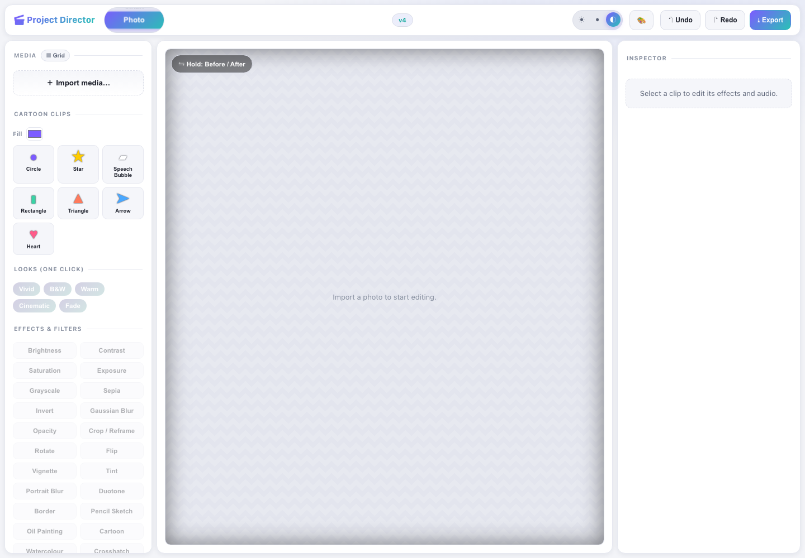
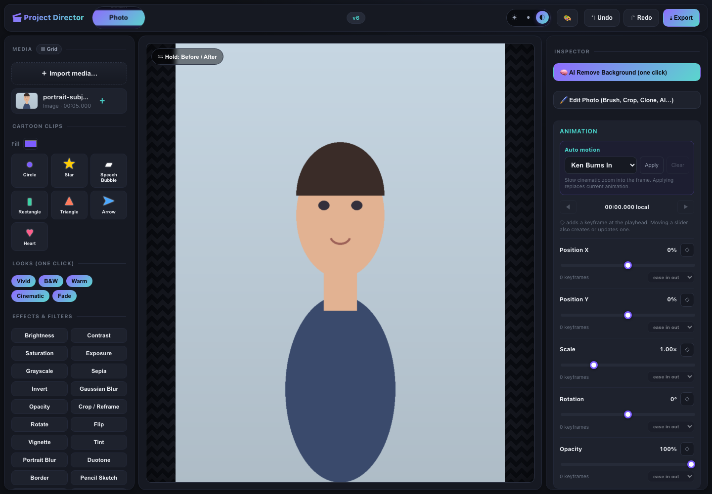
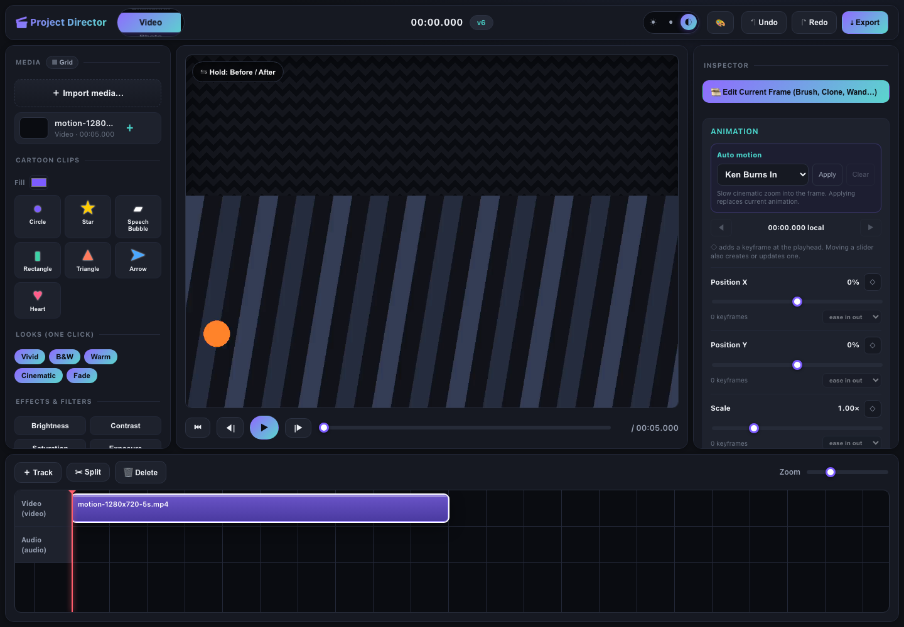
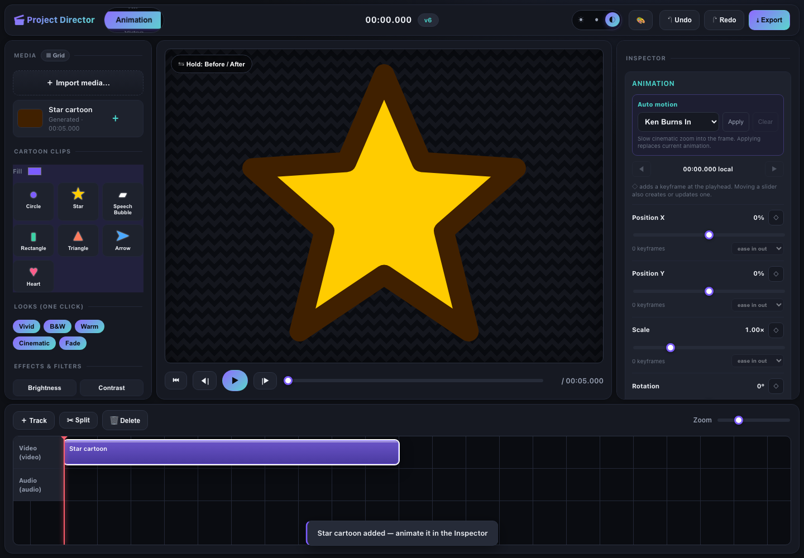
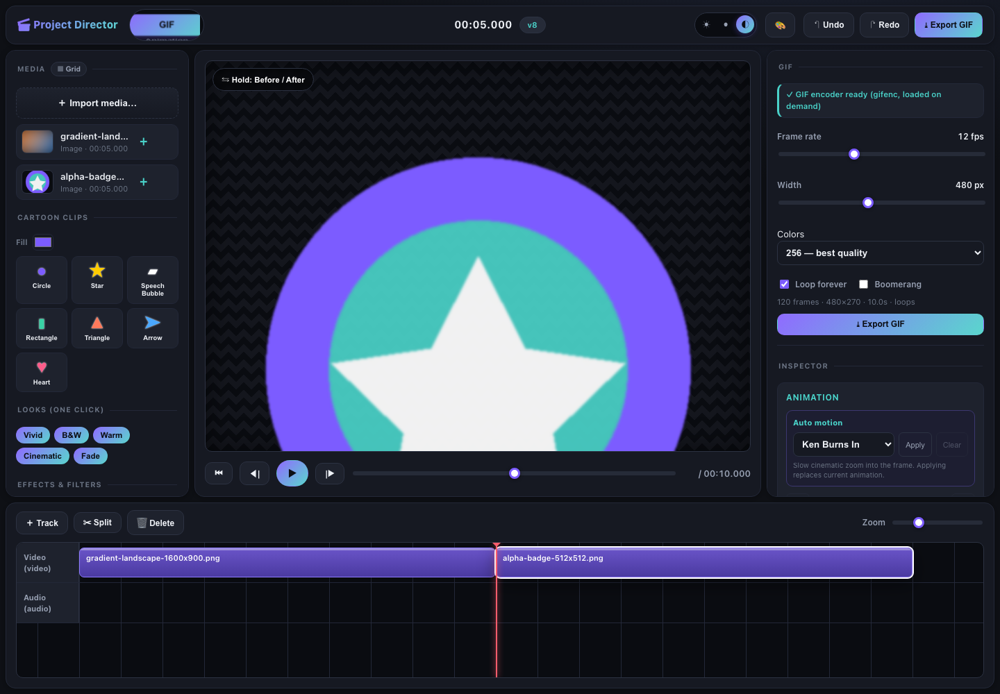

# Project Director User Manual

Photo · Video · Animation · GIF  
Project version 0.1.0 · Updated August 4, 2026

> Maintenance rule: this Markdown file is the editable source of truth. Keep it,
> `Project_Director_User_Manual.docx`, and affected screenshots synchronized by
> following [user-manual-maintenance.md](user-manual-maintenance.md).

Project Director is a non-destructive media editor. Imported originals are
never overwritten. Project edits pass through validated commands, and exports
are downloaded as new files.

## 1. Quick start

Requirements:

- Node.js 20 or newer and pnpm 9 when running from source.
- A modern desktop browser. Chromium is recommended for MP4 export because
  browser video export requires WebCodecs.
- Enough memory for source media and rendered frames. GIF output is capped at
  300 base frames.

Launch the editor:

```bash
pnpm install
pnpm --filter @director/web dev
```

Open the local URL printed by Vite, normally `http://localhost:5173/`.

Basic workflow:

1. Select Photo, Video, Animation, or GIF on the mode wheel.
2. Import an image, video, or audio file, or add a Cartoon Clip.
3. Select the clip in the preview, media bin, or timeline.
4. Apply a Look, effect, animation, transition, or mode-specific tool.
5. Use Undo and Redo to review the change.
6. Export from the current mode.

## 2. Workspace



| Area | Purpose |
| --- | --- |
| Mode wheel | Switches among Photo, Video, Animation, and GIF. Click, scroll, drag vertically, or use Arrow keys. |
| Media panel | Imports files, lists assets, creates cartoon clips, applies Looks and effects, and shows history. |
| Preview | Displays the composited result. Hold Before / After to compare with the source view. |
| Inspector | Edits animation, transitions, effects, and audio gain/pan for the selected clip. |
| Transport | Start, previous frame, play/pause, next frame, seek, timecode, and duration. |
| Timeline | Adds tracks and arranges clips. Split, delete, drag, select, and zoom are available. |
| Top bar | Theme and skin controls, Undo, Redo, version badge, and Export. |

### Shared tools

- Import supports images, video, and audio that the current browser can decode.
- Images receive a default five-second duration.
- One-click Looks: Vivid, B&W, Warm, Cinematic, and Fade.
- Common effects: brightness, contrast, saturation, exposure, blur, opacity,
  crop/reframe, rotate, flip, artistic treatments, text, and background removal.
- Visual clips can animate Position X, Position Y, Scale, Rotation, and Opacity.
- Easing choices: linear, hold, ease-in, ease-out, and ease-in-out.
- Crossfade blends with content underneath; dip ramps against a selected color.

## 3. Photo mode



Photo mode is for image correction, styling, pixel edits, portrait work,
captions, background removal, and PNG export.

Features:

- Adjustments: brightness, contrast, saturation, exposure, grayscale, sepia,
  invert, blur, opacity, crop/reframe, rotate, flip, vignette, and tint.
- Creative effects: Portrait Blur, Duotone, Border, Pencil Sketch, Oil
  Painting, Cartoon, Watercolour, Crosshatch, Halftone, and Text.
- Raster tools: Move, Crop, Transform, Brush, Eraser, Clone Stamp, Lasso,
  Magic Wand, Sharpen, Smart Fill, Remove Background, and AI Remove Background.
- Still-image motion: keyframes plus Ken Burns and other Auto Motion presets.
- Export: the current composited frame as a full-resolution PNG.

Example — polish a portrait:

1. Select Photo and import a portrait.
2. Apply Warm or adjust Brightness and Portrait Blur individually.
3. Hold Before / After to compare with the source.
4. Choose AI Remove Background for one-click isolation, or Edit Photo for
   manual Lasso, Magic Wand, Eraser, and Clone Stamp control.
5. In the raster editor, click Apply to create the edited asset.
6. Click Export to download `export.png`.

Raster strokes use local Undo/Redo until Apply. Project Undo handles the
resulting applied operation.

## 4. Video mode



Video mode supports timeline editing, preview, effects, keyframes,
transitions, audio adjustment, current-frame retouching, and MP4 export.

Features:

- Video and audio tracks with clip selection, split, delete, drag, and zoom.
- Start, previous frame, play/pause, next frame, seek, and synchronized audio.
- Visual controls including hue rotation and Retro Noise in addition to shared
  adjustments and artistic effects.
- Edit Current Frame opens Brush, Clone, Magic Wand, and other raster tools.
- Per-clip gain from −60 to +12 dB and stereo pan from left to right.
- H.264 MP4 export with compatible audio mixed into the result.

Example — make a stylized short video:

1. Select Video and import an MP4 or MOV supported by the browser.
2. Preview with Play or Space and move the playhead with the seek control.
3. Select a clip and use Split and Delete to remove unwanted material.
4. Apply Cinematic, then tune its effects in the Inspector.
5. Apply Pan Left or Drift under Auto Motion.
6. Add crossfade or dip transitions and adjust audio Gain/Pan.
7. Export at 1080p, 720p, or 480p with High, Medium, or Low quality.

MP4 export requires `VideoEncoder`, `AudioEncoder`, and `VideoFrame`. Use a
recent Chromium browser in a permitted local or secure context.

## 5. Animation mode



Animation mode builds motion graphics from generated shapes and imported
visual media.

Features:

- Cartoon clips: Circle, Star, Speech Bubble, Rectangle, Triangle, Arrow, and
  Heart, with a selectable fill color.
- Auto Motion: Ken Burns In, Ken Burns Out, Pan Left, Pan Right, Fade In, Fade
  Out, Pop, Drift, and Loop Pulse.
- Manual keyframes for Position X/Y, Scale, Rotation, and Opacity.
- Previous/next keyframe navigation and timeline keyframe markers.
- Linear, hold, ease-in, ease-out, and ease-in-out easing.
- Shared Looks, effects, Text, and transitions.
- MP4 output through Export, or GIF output after switching to GIF mode.

Example — create a pulsing star:

1. Select Animation, choose a fill, and click Star.
2. Select Loop Pulse under Auto Motion and click Apply.
3. Preview with Play and adjust Scale keyframes if required.
4. Optionally add 0° and 360° Rotation keyframes.
5. Export as MP4, or switch to GIF for a loop-ready animated image.

Applying an Auto Motion preset replaces the current animation as one command,
so one Undo removes the whole preset.

## 6. GIF mode



GIF mode creates short animations from photos, video, generated shapes,
effects, transitions, and keyframes.

| Control | Range or behavior |
| --- | --- |
| Frame rate | 2–30 fps; default 12 fps. |
| Width | 120–960 px in 40 px steps; default 480 px. Height follows source aspect. |
| Colors | 256 best quality, 128 smaller, or 64 smallest. |
| Loop forever | Enabled by default. |
| Boomerang | Adds the reverse frame order for forward-and-back playback. |
| Encoder | `gifenc`, loaded when GIF mode is selected. |
| Frame cap | 300 base frames to protect browser memory. |

Example — create a two-photo loop:

1. Select GIF and wait for “GIF encoder ready.”
2. Import two photos; they appear sequentially on the timeline.
3. Start with 12 fps, 480 px, and 256 colors.
4. Leave Loop forever enabled; optionally enable Boomerang.
5. Add Fade keyframes or transitions if the cut is too abrupt.
6. Review the frame/dimension/duration summary and click Export GIF.

To reduce file size, lower width first, then frame rate, then palette colors.

## 7. Export reference

| Mode | Result | Notes |
| --- | --- | --- |
| Photo | PNG | Current composited frame at native/post-crop size. |
| Video | MP4 | H.264 video, optional mixed audio, resolution and bitrate presets. |
| Animation | MP4 | Same timeline renderer, including shapes, effects, keyframes, and transitions. |
| GIF | GIF | Configurable frame rate, width, colors, loop, and boomerang. |

Video resolutions are 1920×1080, 1280×720 (default), and 854×480. Quality
presets are 12 Mbps, 8 Mbps (default), and 4 Mbps.

## 8. Shortcuts

| Input | Action |
| --- | --- |
| Cmd/Ctrl + Z | Undo. |
| Cmd/Ctrl + Shift + Z | Redo. |
| Space | Play or pause when page body has focus. |
| Delete / Backspace | Delete the selected clip when page body has focus. |
| Wheel Arrow keys | Previous or next mode. |
| Wheel Home / End | Photo / GIF. |
| Hold Before / After | Compare edited and source views. |

## 9. Troubleshooting

- **File will not import:** use an image, video, or audio format the browser can
  decode; try PNG/JPEG or H.264 MP4.
- **Blank preview:** select the clip and move the playhead inside its range.
- **GIF encoder failure:** verify module loading, leave GIF mode, and reselect it.
- **GIF too large:** reduce width, frame rate, colors, duration, or boomerang.
- **MP4 unavailable:** use recent Chromium with WebCodecs.
- **AI removal failure:** verify U²-Net/ONNX assets, or use Remove Background,
  Magic Wand, or Lasso.
- **Disabled effect:** select a clip first.
- **Shortcut does nothing:** click an empty part of the page; global shortcuts
  intentionally do not fire while a form control has focus.

## Revision notes

- **2026-08-04:** Initial current-state manual covering Photo, Video,
  Animation, GIF, export, screenshots, and maintenance enforcement.
